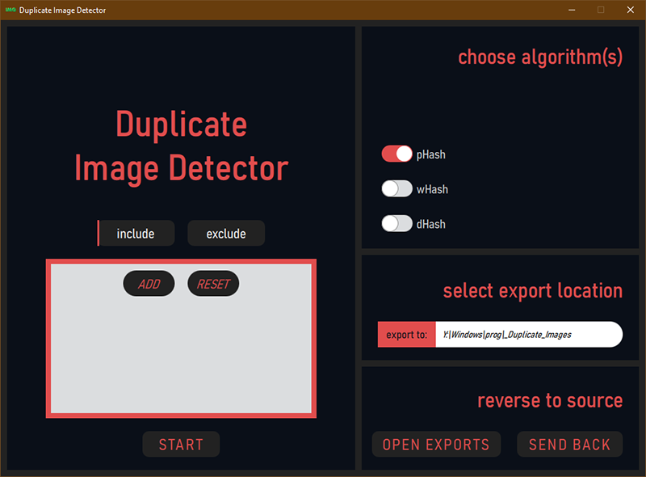
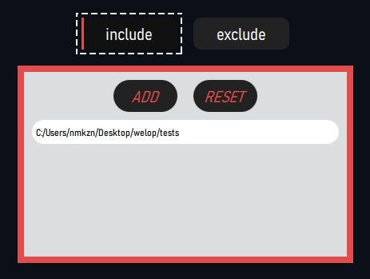
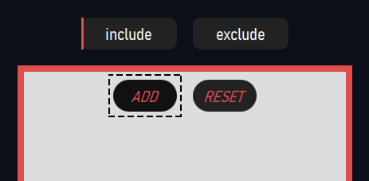
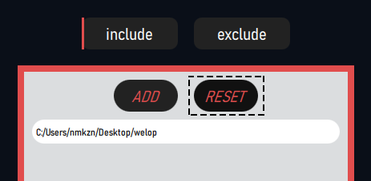
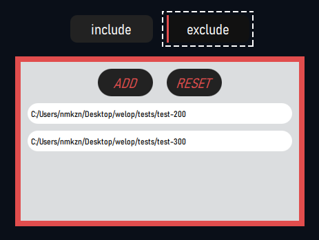
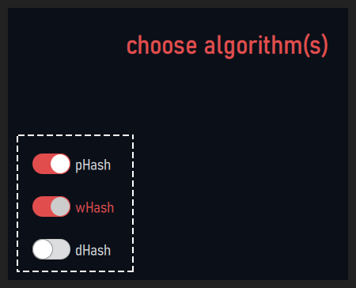
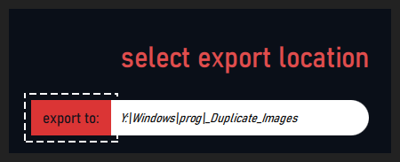
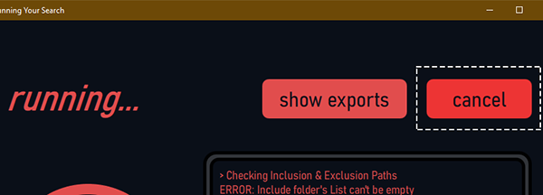

# Duplicate Image Detector (pySide2WinApp)

---

### About
This is a Python GUI Application that can be used to find duplicate images in specified folders. Lets you choose duplicate detection algorithm if you so choose, otherwise the default is fine for most usecases.

Example ***speed*** and ***accuracy*** scaling for `368 files`.
|Algorithm|Speed|Detections|
|---------|-----|----------|
|pHash|03.2714 secs|083 &check; 00 &cross;|
|wHash|13.4508 secs|112 &check; 79 &cross;|
|dHash|03.1157 secs|083 &check; 07 &cross;|

`just an example, not universally representative of the scope`

---

### Downloads (choice)
1. [Source Code (zip)](https://github.com/kuhru/pySide2_pyApp-Duplicate-Image-Detector/archive/refs/heads/master.zip)
<!-- 2. [Windows Application](NOT-RUNNING-ATM) -->

---

### Setup (only for choice 1)
1. Create a [virtual environment](https://packaging.python.org/guides/installing-using-pip-and-virtual-environments/) and activate said the venv.
2. Install dependencies using requirements.
```python
>>> python -m pip -r requirements.txt
```
3. Run the [`main.py`](main.py).

---

### Usage #Starting
Once you run the application, regardless of if from executable or script.<br>
>First time run from exe will be slow, because building cache. Run it on a small folder with maybe even 1 file. From then onwards, you can run it anytime and it'll perform normally.

1. Once you Run the Application, you'll be greeted with this screen.<br>


2. If you want to manage the folders that are to be searched, click here.<br>


3. From there, click add to add a folder to the list.<br>


4. If you want to remove a folder then click here.<br>


5. If the folder you want to search in has subfolders that you don't want to search in, add those folders here.<br>
<br>
Add and reset buttons work similarly as with the inclusion.

6. You can leave this setting as it is, but if you want to mess around, go ahead, you can select muliple algorithms.<br>
<br>
    `> P-Hash:` Very fast, least false positives, good duplicate detection.<br>
    `> W-Hash:` Slowest, many false positives, most duplicate detection.<br>
    `> D-Hash:` Fastest, some false positives, moderate duplicate detection.<br>

7. The duplicates that are discovered will be moved to this location.<br>
<br>
Not mandatory, but would be easier to manage if you let this folder be empty. This will have a default location based on where you run the applicaiton if you don't want to choose a folder.

8. That's all, go ahead, run the application and sit back.

---

### Usage #During The Process
Once you have started the detected, here are some extra things you can use.
1. You can use these button to open the export folder.<br>
<br>
If it doesn't already exist, the folder will be created.

2. If you need to stop the application in middle of execution, like maybe the application says it is running hash or finding duplicates, and you want to stop it then click here.<br>
<br>
Closing via the main [x](#) button on the window has other functionality tied to it, that will not stop the processing.

---

### Usage #After Duplicate Detection
Once the application has run and found duplicates, you can go to folder and do whatever you want with the copies, and once you are done, click this button.<br>
<br>
This will move the files back to their original source.

---
# This is a College Project
Reduce the image into 32×32-pixel size
Convert the small image to greyscale.
Transform the greyscale image using DCT (Discrete Cosine Transform).
Slice only the top-left 8×8 from 32×32 DCT.
Calculate average of the above obtained matrix excluding the [0][0] index.
initialize a new 8×8 matrix.
if mean > topLeft[i][j]
    new[i][j] = 1
else
    new[i][j] = 0
calculate the hash of 64 bits.
calculate Hamming distance from hash received from other images.
if number of different bits lies between 1 to 10
    implies images are same.
else if different bits>10
    implies different images.
